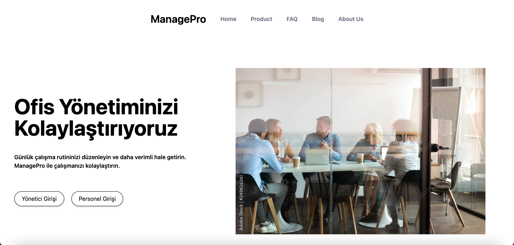

# ManagePro

ManagePro is a  admin dashboard application designed to simplify personnel management processes.This project was developed as part of a given task and serves as an example of a Turkish-language application. The codebase includes comments in Turkish. The platform enables administrators to handle tasks like monitoring attendance, managing leave requests, and sending critical notifications with an intuitive and responsive user interface.
## Screenshots

## Features

- **User Authentication:**
  - Admin and personnel role-based access.
  - Secure login/logout functionality with JWT-based authentication.

- **Attendance Management:**
  - Track personnel's daily check-in and check-out times.
  - Calculate office duration and late arrivals dynamically.

- **Leave Management:**
  - Submit leave requests with start/end dates and reasons.
  - Admin approval/rejection of leave requests.
  - Automatic deduction of remaining leave days upon approval.
  - Notification triggers for low remaining leave days.

- **Real-Time Updates:**
  - Seamless integration with DataTables for dynamic data handling.
  - Immediate feedback on leave approval or rejection actions.

## Technologies Used

- **Backend:**
  - Django REST Framework for API development.
  - PostgreSQL for database management.

- **Frontend:**
  - Tailwind CSS for styling.
  - DataTables for dynamic data visualization.
  - Vanilla JavaScript for custom interactivity.

- **Others:**
  - JWT for secure authentication.
  - jQuery for DOM manipulation and AJAX calls.

## Installation

1. Clone the repository:
   ```bash
   git clone https://github.com/yourusername/managepro.git
   cd managepro
